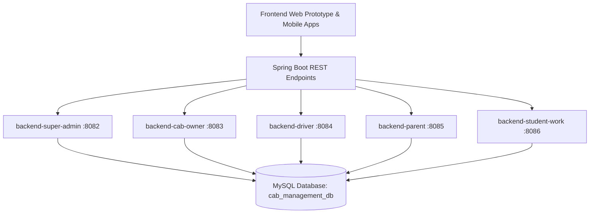

# SafePassage AI: School, College & Corporate Cab Management System
## Complete System Technical Documentation & Visual Application Showcase

---

## 📍 Quick Document Access Locations

1. **Workspace Project File**: [docs/SYSTEM_DOCUMENTATION_AND_APP_SHOWCASE.md](file:///c:/Users/DELL/OneDrive/Documents/school&college_cab_managements_software/docs/SYSTEM_DOCUMENTATION_AND_APP_SHOWCASE.md)
2. **Artifact Directory Document**: [system_documentation_and_app_showcase.md](file:///C:/Users/DELL/.gemini/antigravity-ide/brain/9dea715d-8137-4039-9865-1a67ea23b0a1/system_documentation_and_app_showcase.md)
3. **Walkthrough Document**: [walkthrough.md](file:///C:/Users/DELL/.gemini/antigravity-ide/brain/9dea715d-8137-4039-9865-1a67ea23b0a1/walkthrough.md)
4. **Screenshots Directory**: [docs/screenshots/](file:///c:/Users/DELL/OneDrive/Documents/school&college_cab_managements_software/docs/screenshots/)

---

## 📱 1. Core Visual App Showcase & Live Workflows

### A. Single Trip 45-Second Dispatch & OTP Verification Protocol


#### Workflow Summary:
1. **On-Demand Trip Request**: Parent / Commuter inputs pickup address (`Mehta Nagar Anna Arch Gate`) and drop location (`ABC Matriculation School`). Estimated fare (`₹180`) is calculated automatically.
2. **45-Second Circular Countdown Timer**: The dispatch request is routed immediately to the nearest verified driver (`Kumar Swamy, White Mercedes Van TN 01 AB 1234`). A circular SVG timer counts down from 45 seconds with audio ticks.
3. **Dynamic 4-Digit Pickup OTP (`8492`)**: Generated cryptographically and shown exclusively on the passenger/parent terminal.
4. **Driver Keypad Verification**: When the driver reaches the gate, they enter the 4-digit OTP. On successful validation, status updates to `IN_PROGRESS / PASSENGER_BOARDED` and activates live telemetry speed (`36 km/h`).
5. **Dropoff & Invoicing**: Completing the ride logs distance (`4.2 km`) and payment directly into MySQL `single_trips` and `payments`.

---

### B. Three-Version Map Arena (Parent vs Driver vs Super Admin)


#### Three Distinct Map Engines:
1. **Parent Radar View (Left)**:
   - Dynamic 0.5 to 2.0-mile adjustable geofence corridor around student boarding location.
   - Proximity radar triggers push alerts when the cab enters the geofence perimeter (`ETA 6 mins`).
2. **Driver Waypoints View (Center)**:
   - Turn-by-turn road navigation linking pickup stops (`Mehta Nagar ➔ Kasturba Nagar ➔ ABC School`).
   - Conductor digital roster with student checklist (Boarded / Absent / Pending) and speed telemetry (`36 km/h`).
3. **Super Admin City Heatmap (Right)**:
   - Aggregate metropolitan Chennai transit density clusters (Kattur, Nungambakkam, Tambaram, Anna Nagar West, OMR IT Park, Velachery).
   - High-demand corridor optimization, fleet GPS pins, and active emergency SOS markers.

---

### C. Super Admin Demand Analytics & AI Route Matching Dashboard


#### Key Dashboard Metrics:
- **Total Transit Demand**: `1,248` active requests (+12% trend).
- **Available Seat Capacity**: `892` verified seats.
- **Active Transit Routes**: `86` daily transit corridors with `71%` average fill rate.
- **Demand Breakdown**: School (`32%`), College (`28%`), Corporate Work (`40%`).
- **AI Route Matcher**: 95% Best Match recommendation algorithm based on departure windows, seat capacity, and origin-destination proximity.

---

## 🏗️ 2. Microservices Architecture & Endpoint Mapping



### Microservice Endpoints Matrix:

| Microservice | Port | Database Entity | Key REST Endpoints |
|---|---|---|---|
| **`backend-super-admin`** | `8082` | `users`, `institutions`, `vehicles`, `payments`, `single_trips` | `POST /api/auth/login`<br>`GET /api/dashboard/stats`<br>`GET /api/admin/analytics/demand-overview`<br>`GET /api/admin/trips/single` |
| **`backend-parent`** | `8085` | `child_profiles`, `subscription_payments`, `guardian_passes`, `faqs`, `single_trips` | `POST /api/parent/trip/single/request`<br>`POST /api/parent/packages/subscribe`<br>`POST /api/parent/sos`<br>`GET /api/parent/faqs` |
| **`backend-driver`** | `8084` | `trip_logs`, `checklist_logs`, `driver_telematics`, `safety_sweeps`, `single_trips` | `POST /api/driver/trip/single/accept`<br>`POST /api/driver/trip/single/arrived`<br>`POST /api/driver/trip/single/verify-otp`<br>`POST /api/driver/trip/single/complete` |
| **`backend-student-work`** | `8086` | `commute_passes` | `GET /api/commute/ai-match`<br>`POST /api/commute/book`<br>`GET /api/commute/attendance`<br>`GET /api/commute/tracking/live` |
| **`backend-cab-owner`** | `8083` | `vehicles`, `driver_assignments`, `payments` | `GET /api/fleet`<br>`POST /api/fleet/register`<br>`GET /api/fleet/earnings` |

---

## 🗄️ 3. Unified MySQL Database Schema (`cab_management_db`)

Database seed script location: [backends/unified_schema_seed.sql](file:///c:/Users/DELL/OneDrive/Documents/school&college_cab_managements_software/backends/unified_schema_seed.sql)

```sql
-- Database: cab_management_db
CREATE DATABASE IF NOT EXISTS cab_management_db;
USE cab_management_db;

-- 1. Single Trips Table
CREATE TABLE single_trips (
    id BIGINT AUTO_INCREMENT PRIMARY KEY,
    passenger_name VARCHAR(150) NOT NULL,
    passenger_email VARCHAR(150) NOT NULL,
    passenger_phone VARCHAR(50) NOT NULL,
    pickup_address VARCHAR(255) NOT NULL,
    drop_address VARCHAR(255) NOT NULL,
    pickup_lat DOUBLE DEFAULT 13.0725,
    pickup_lng DOUBLE DEFAULT 80.2180,
    drop_lat DOUBLE DEFAULT 13.0815,
    drop_lng DOUBLE DEFAULT 80.2355,
    driver_id BIGINT NULL,
    driver_name VARCHAR(150) NULL,
    vehicle_plate VARCHAR(50) NULL,
    fare DOUBLE DEFAULT 180.0,
    otp_code VARCHAR(10) NOT NULL,
    status VARCHAR(50) DEFAULT 'REQUESTED',
    countdown_seconds INT DEFAULT 45,
    requested_at DATETIME DEFAULT CURRENT_TIMESTAMP,
    accepted_at DATETIME NULL,
    otp_verified_at DATETIME NULL,
    completed_at DATETIME NULL
);

-- 2. Commute Passes Table
CREATE TABLE commute_passes (
    id BIGINT AUTO_INCREMENT PRIMARY KEY,
    user_email VARCHAR(150) NOT NULL,
    user_name VARCHAR(150) NOT NULL,
    commuter_type VARCHAR(50) NOT NULL,
    institution_or_company VARCHAR(200) NOT NULL,
    route_id BIGINT NULL,
    pass_type VARCHAR(50) DEFAULT 'MONTHLY',
    amount_paid DOUBLE NOT NULL,
    status VARCHAR(50) DEFAULT 'ACTIVE'
);

-- 3. Payments Table
CREATE TABLE payments (
    id BIGINT AUTO_INCREMENT PRIMARY KEY,
    payer_email VARCHAR(150) NOT NULL,
    recipient_email VARCHAR(150) NOT NULL,
    amount DOUBLE NOT NULL,
    type VARCHAR(50) NOT NULL,
    status VARCHAR(50) DEFAULT 'SUCCESS',
    payment_date DATETIME DEFAULT CURRENT_TIMESTAMP,
    invoice_no VARCHAR(100) NOT NULL UNIQUE
);
```

---

## 📱 4. Multi-Role App Structure

1. **`web-prototype/`**: Full web portal & simulator supporting Super Admin, Parent, Driver, Cab Owner, Student, and Professional with interactive 3-Version Maps, Single Trip 45s OTP modal, and Packages pass checkout.
2. **`frontend-mobile-parent/`**: Dedicated Parent app with safe passage geofence radar, one-tap absence planner, and digital guardian passes.
3. **`frontend-mobile-driver/`**: Dedicated Driver app with conductor checklist, OTP verification keypad, anti-abandonment safety sweeps, and emergency cab swap protocol.
4. **`frontend-mobile-admin/`**: Executive transport manager mobile app with live demand analytics and vehicle KYC approval desk.
