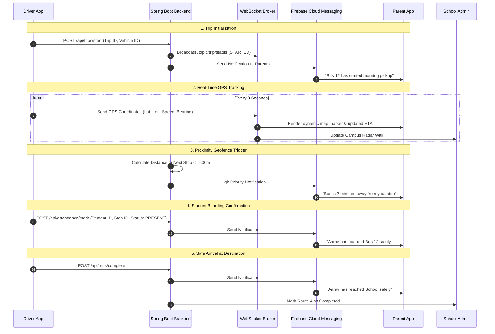

# School & College Cab Management System
## Complete System Architecture, Page Workflows & Role-Based Operational Pipelines

---

## 📑 Table of Contents
1. [System Architecture & Data Pipelines](#1-system-architecture--data-pipelines)
2. [Security, Authentication & Role-Based Access Control (RBAC)](#2-security-authentication--role-based-access-control-rbac)
3. [Role 1: Parent (School Student Guardian)](#3-role-1-parent-school-student-guardian)
   - 3.1 Onboarding & Authentication Flow
   - 3.2 Dashboard & Child Switcher
   - 3.3 Find Transport & Smart Route Matching
   - 3.4 Subscription Plans & Invoicing
   - 3.5 Real-Time Tracking & Live GPS Telemetry
   - 3.6 Journey Timeline & Attendance Audit
   - 3.7 Child Journey Passport (Dynamic QR Identity)
   - 3.8 Safety, Speed Governance & Emergency SOS
4. [Role 2: Driver & Conductor](#4-role-2-driver--conductor)
   - 4.1 Driver Authentication & Vehicle Pairing
   - 4.2 Trip Lifecycle Engine (Start -> Waypoints -> Complete)
   - 4.3 Student Boarding Checklist & QR Scanner
   - 4.4 Turn-by-Turn Route Navigation & Traffic Reporting
   - 4.5 Driver Profile, Compliance & Shift Logs
5. [Role 3: Cab Owner / Fleet Operator](#5-role-3-cab-owner--fleet-operator)
   - 5.1 Fleet Operations Command
   - 5.2 Vehicle Lifecycle & Fitness Verification
   - 5.3 Driver Allocation & Roster Scheduling
   - 5.4 Route Creation, Seat Inventory & Pricing
   - 5.5 Financial Ledger, Fuel Logs & Payouts
6. [Role 4: College Student & Working Professional](#6-role-4-college-student--working-professional)
   - 6.1 Commuter Profile & Campus/Tech Park Selection
   - 6.2 Dynamic Route Discovery & Seat Reservation
   - 6.3 Flexible Commute Pass & QR Boarding
   - 6.4 Shared Cost Calculator & Savings Tracker
7. [Role 5: Institute / School Admin](#7-role-5-institute--school-admin)
   - 7.1 Real-Time Campus Radar Map
   - 7.2 Student Transport Roster & Allocation
   - 7.3 Driver Compliance & Document Verification Desk
   - 7.4 Speed & Geofence Incident Governance
   - 7.5 Grievance Management & Parent Support
8. [Role 6: Super Administrator (Platform Operator)](#8-role-6-super-administrator-platform-operator)
   - 8.1 Multi-Tenant Governance
   - 8.2 Global KYC & Background Verification Hub
   - 8.3 Escrow Payouts, Commissions & Billing Engine
   - 8.4 Microservice Health & System Diagnostics
9. [Real-Time Notification & Event Flow Matrix](#9-real-time-notification--event-flow-matrix)
10. [REST API & Microservice Specifications](#10-rest-api--microservice-specifications)

---

# 1. System Architecture & Data Pipelines

The system is engineered on an event-driven, distributed microservice architecture comprising **5 Spring Boot backend services**, a **Redis caching & geospatial layer**, **WebSocket / STOMP real-time brokers**, **Firebase Cloud Messaging (FCM)**, and specialized **React Native / Web frontend interfaces**.

```
+---------------------------------------------------------------------------------------+
|                                    CLIENT APPLICATIONS                                |
|  [Parent Mobile App]    [Driver Mobile App]    [Student/Pro App]    [Admin Web Portal]|
+-------------------------------------------+-------------------------------------------+
                                            | HTTPS / WSS
                                            v
+---------------------------------------------------------------------------------------+
|                                  API GATEWAY / AUTH                                  |
|                            Spring Security JWT Validator                              |
|                            Rate Limiter & CORS Controller                             |
+-------------------------------------------+-------------------------------------------+
                                            |
         +----------------------------------+----------------------------------+
         |                                  |                                  |
         v                                  v                                  v
+------------------+              +-------------------+              +------------------+
| REDIS DATA GRID  |              | WEBSOCKET BROKER  |              | FIREBASE (FCM)   |
| - GPS Coordinates|              | - Real-time Bus   |              | - Boarding Push  |
| - Seat Locks     |              |   Position & ETA  |              | - SOS Siren      |
| - Session Cache  |              | - Speed Telemetry |              | - Proximity Alert|
+--------+---------+              +---------+---------+              +--------+---------+
         |                                  |                                 |
         +----------------------------------+---------------------------------+
                                            | Internal Service Bus
                                            v
+---------------------------------------------------------------------------------------+
|                               SPRING BOOT MICROSERVICES                               |
|                                                                                       |
|  [backend-super-admin]     [backend-parent]      [backend-cab-owner]                 |
|       (Port 8081)             (Port 8082)            (Port 8083)                      |
|  - Platform Governance    - Children Profiles    - Fleet Management                   |
|  - KYC & Escrow Payouts   - Subscriptions & Pay  - Route/Seat Setup                   |
|                                                                                       |
|  [backend-driver]          [backend-student-work]                                     |
|       (Port 8084)             (Port 8085)                                             |
|  - Trip Lifecycle & GPS   - Campus Route Matching                                     |
|  - Attendance Checklist   - Digital Route Passes                                      |
+-------------------------------------------+-------------------------------------------+
                                            |
                                            v
+---------------------------------------------------------------------------------------+
|                                   PERSISTENCE LAYER                                   |
|             [PostgreSQL / MySQL Core DB]      [AWS S3 Secure Cloud Store]            |
|             - Users, Routes, Attendance       - Driver DL, RC Books, Child Photos    |
+---------------------------------------------------------------------------------------+
```

---

# 2. Security, Authentication & Role-Based Access Control (RBAC)

Every user interacts through a strictly authenticated role claim embedded in their cryptographically signed **JWT Token**:

| Role Constant | Target User | Allowed Operations |
| :--- | :--- | :--- |
| `ROLE_PARENT` | Guardians | Child profiles, live tracking, invoices, subscriptions, SOS |
| `ROLE_DRIVER` | Bus Drivers / Conductors | Start trip, mark student attendance, broadcast GPS, delay updates |
| `ROLE_CAB_OWNER` | Fleet Operators | Add vehicles, assign drivers, publish routes, view financial ledger |
| `ROLE_STUDENT` | College Students | Discover campus routes, reserve seats, pay monthly pass |
| `ROLE_WORK` | Working Professionals | Discover tech park shuttles, split bills, track live cab |
| `ROLE_ADMIN` | School / College In-Charge | Campus radar, approve drivers, view compliance, audit trips |
| `ROLE_SUPER_ADMIN` | Platform Operator | Multi-tenant governance, KYC approval, escrow payouts, server health |

---

# 3. Role 1: Parent (School Student Guardian)

### Persona Description
A parent wanting hassle-free, secure daily transport for their school children, complete with reliable live tracking, boarding verification, and automated monthly subscription payments.

---

### 3.1 Onboarding & Authentication Flow
1. **Screen**: `LoginScreen.tsx`
2. **Workflow**:
   - Parent launches the mobile application.
   - Screen presents options:
     - **Phone Number / Email + Password** login.
     - **One-Tap Quick Login** for instant session restoration.
     - **New Account Registration**: Parent enters Full Name, Phone, Email, Password, Emergency Contact 1 & 2, and Residential Address.
   - On submission, credentials pass through `POST /api/auth/login`.
   - The response injects JWT and profile payload into `authSlice` (Redux) and transitions to `ParentHomeScreen`.

---

### 3.2 Dashboard & Child Switcher
1. **Screen**: `ParentHomeScreen.tsx`
2. **Workflow**:
   - Top Bar displays parent name and profile avatar with active connection indicator.
   - **Child Switcher Carousel**: If a parent has multiple enrolled children (e.g., *Aarav - Grade 6* and *Ananya - Grade 2*), tapping their profile chip immediately rebinds the entire dashboard state to that child's assigned cab, route, and driver.
   - **Trip Status HUD**:
     - Status badges: `NOT_STARTED` (Grey), `ON_THE_WAY` (Amber), `BOARDED` (Blue), `DROPPED_AT_SCHOOL` (Emerald Green).
     - Live ETA display showing vehicle number plate, distance in meters, and estimated arrival time.
   - **Quick Action Grid**:
     - 📍 *Live Track*
     - 🔍 *Find Transport*
     - 💳 *Subscription & Invoices*
     - 📋 *Journey Timeline*
     - 🛡️ *Journey Passport*
     - 🚨 *Emergency SOS*

---

### 3.3 Find Transport & Smart Route Matching
1. **Screens**: `FindTransportScreen.tsx` ➔ `AvailableTransportScreen.tsx`
2. **Workflow**:
   - Parent enters child's school name, grade, pickup location, and shift (Morning Shift 07:30 AM / Afternoon Shift 01:30 PM).
   - The backend runs a spatial query matching cabs that traverse within a 1.5 km corridor of the parent's doorstep.
   - Parent browses verified transport listings showing:
     - Vehicle Type (e.g., *Force Urbania 17-Seater*, *Tata Winger AC*).
     - Driver rating, police verification badge, in-cab CCTV indicator.
     - Available seats remaining (e.g., "3 Seats Left").

---

### 3.4 Subscription Plans & Invoicing
1. **Screens**: `SelectPlanScreen.tsx` ➔ `PaymentInvoiceScreen.tsx` ➔ `PaymentsScreen.tsx`
2. **Workflow**:
   - Parent selects billing tier:
     - **Standard Monthly Plan**: ₹2,500/month.
     - **Quarterly Saver Plan**: ₹7,125 (5% discount).
     - **Annual Plan**: ₹25,500 (15% discount).
   - Optional Add-ons: "Doorstep Stop Guarantee (+₹200/mo)" or "Live In-Cab Video Access (+₹350/mo)".
   - Executes payment via simulated / integrated gateway (UPI, Cards).
   - Generates GST compliant invoice with transaction reference ID, tax breakdown, and printable PDF copy.

---

### 3.5 Real-Time Tracking & Live GPS Telemetry
1. **Screen**: `LiveTrackScreen.tsx`
2. **Workflow**:
   - Connects to WebSocket topic `/topic/trip/{tripId}/location`.
   - Renders interactive map featuring:
     - Dynamic marker with bearing rotation matching the vehicle's heading.
     - Route polyline with historical traversed path and pending route stops.
     - Telemetry gauges: Speed (km/h), Distance to Pickup Point (m), Expected Delay indicator.
     - Driver Call & WhatsApp buttons with one-tap dialing.
     - Safety speed alert: If vehicle exceeds 50 km/h, the parent UI highlights the speed pill in flashing red.

---

### 3.6 Journey Timeline & Attendance Audit
1. **Screen**: `JourneyTimelineScreen.tsx`
2. **Workflow**:
   - Immutable chronologic ledger of today's commute:
     - `07:10 AM` - Trip initialized by Driver Suresh Patil.
     - `07:28 AM` - Near Location alert triggered (Vehicle 450m away).
     - `07:34 AM` - Student Boarded at *Sector 4 Gate 2* (Verified via QR Scan).
     - `08:05 AM` - Vehicle arrived at *Delhi Public School*. Student safely dropped.

---

### 3.7 Child Journey Passport (Dynamic QR Identity)
1. **Screen**: `PassportScreen.tsx`
2. **Workflow**:
   - Renders a secure, high-contrast digital ID pass for the student.
   - Encodes Student ID, Guardian Contact, Medical Notes (Blood Group, Allergies), Emergency Alternate Phone, and Bus Number.
   - Driver or Conductor scans this code upon boarding to confirm identity.

---

### 3.8 Safety, Speed Governance & Emergency SOS
1. **Screen**: `EmergencySOSScreen.tsx`
2. **Workflow**:
   - High-visibility pulsing emergency button.
   - Pressing initiates a 3-second safety countdown to prevent accidental clicks.
   - Dispatches emergency payload to:
     - Nearest police PCR control room.
     - School transport administrative desk.
     - Fleet Owner dispatch center.
     - Alternate family contacts via automated SMS and loud siren push notification.

---

# 4. Role 2: Driver & Conductor

### Persona Description
Drivers and conductors responsible for operating the vehicle safely, navigating optimal routes, recording student boarding/alighting events, and updating route delays.

---

### 4.1 Driver Authentication & Vehicle Pairing
1. **Screen**: `LoginScreen.tsx` (Driver Mode)
2. **Workflow**:
   - Driver logs in using registered mobile phone and 4-digit security PIN.
   - Selects today's assigned vehicle from active fleet list (e.g., *Bus 09 - DL-1VA-4421*).
   - System verifies driver's active driving license status from backend before granting trip start clearance.

---

### 4.2 Trip Lifecycle Engine
1. **Screens**: `ConductorScreen.tsx` ➔ `RouteMapScreen.tsx`
2. **Workflow**:
   - **State 1: Trip Not Started**: Driver reviews full route itinerary (14 stops, 22 registered students).
   - **State 2: Start Morning Route**:
     - Driver taps `[Start Trip]`.
     - App starts background geolocation service, sampling GPS coordinates every 3,000ms.
     - Backend broadcasts `TRIP_STARTED` event to all enrolled parents on this route.
   - **State 3: En Route & Attendance**:
     - At each scheduled stop, driver checks off the student or scans their Journey Passport QR code.
     - Tapping `[Boarded]` emits `STUDENT_BOARDED` push notification to the respective parent.
     - Tapping `[Absent]` flags student as absent for the day.
   - **State 4: Complete Trip**:
     - Arriving at school gate, driver taps `[Complete Trip]`.
     - Final `STUDENT_DROPPED_SAFE` notification dispatched. GPS tracking terminates.

---

### 4.3 Route Map HUD & Delay Broadcasting
1. **Screen**: `RouteMapScreen.tsx`
2. **Workflow**:
   - High-contrast navigation view designed for in-vehicle phone mounts.
   - Displays Next Stop Name, Remaining Distance, and Passenger Count.
   - **Incident / Delay Quick-Buttons**:
     - 🚧 *Heavy Traffic (+10 mins)*
     - 🔧 *Vehicle Breakdown (Dispatches replacement shuttle)*
     - 🌧️ *Weather Delay*
   - Activating a delay button automatically updates ETA calculations across all connected parent apps.

---

### 4.4 Driver Profile & KYC Validation
1. **Screen**: `DriverProfileScreen.tsx`
2. **Workflow**:
   - Shows Driver Name, Badge ID, Commercial DL Number, DL Expiry Date, and Police Clearance Certificate status.
   - Displays driving score, safety audit rating (e.g., `4.92 / 5.0`), and total completed trips.

---

# 5. Role 3: Cab Owner / Fleet Operator

### Persona Description
Fleet managers and private cab owners who own vehicles, hire drivers, configure school/college routes, and track daily revenue.

---

### 5.1 Fleet Operations Command
1. **Screen**: `CabOwnerScreen.tsx`
2. **Workflow**:
   - **Executive KPIs**:
     - Total Fleet Size (e.g., 6 Vehicles).
     - Vehicles Active on Road (e.g., 5 Active, 1 Maintenance).
     - Total Subscribed Passengers (118 riders).
     - Monthly Revenue (₹2,95,000).
     - Average Seat Occupancy Rate (89.4%).

---

### 5.2 Vehicle & Driver Asset Management
1. **Workflow**:
   - **Add Vehicle**: Enter Registration Number, Model, Seating Capacity (14/20/32), GPS Device IMEI, Insurance Expiry, Fitness Certificate (FC) Expiry.
   - **Assign Driver**: Link a verified driver profile to a specific vehicle.
   - **Maintenance Tracker**: Log oil changes, tire replacement cycles, and service reminders.

---

### 5.3 Route & Seat Inventory Configuration
1. **Workflow**:
   - Configure custom routes with stop names, geographic lat/long coordinates, and planned arrival schedules.
   - Define monthly subscription price per seat (e.g., ₹2,800/seat).
   - Dynamic Seat Inventory: Unsubscribed seats are automatically published to the open marketplace for students and working professionals.

---

# 6. Role 4: College Student & Working Professional

### Persona Description
Individual adult commuters requiring affordable, predictable, shared daily shuttle transport between home neighborhoods and college campuses or tech parks.

---

### 6.1 Workspace & Mode Switching
1. **Screen**: `StudentProfessionalScreen.tsx`
2. **Workflow**:
   - Commuter toggles between **College Student Mode** and **Working Professional Mode**.
   - Selects target campus (e.g., *IIT Delhi*, *PES University*, *DLF CyberCity*, *Manyata Tech Park*).

---

### 6.2 Route Discovery & Dynamic Seat Booking
1. **Workflow**:
   - Search by pickup stop and destination tech park.
   - System displays matching express shuttles with departure time slots (e.g., `07:45 AM Shift 1`, `08:30 AM Shift 2`).
   - Interactive Seat Map: Choose preferred seat (Window, Aisle, Front).
   - Checkout with Daily Commute Pass, Weekly Pass, or Monthly Flexi Pass.

---

### 6.3 Digital Route Pass & Real-Time Cab Locator
1. **Workflow**:
   - Instant generation of dynamic RFID/QR commuter pass.
   - Live tracking map showing incoming shuttle, seat reservation number, and driver contact.
   - Commute Savings Calculator: Displays money saved vs. ride-hailing services (e.g., *"You saved ₹4,200 this month"*).

---

# 7. Role 5: Institute / School Admin

### Persona Description
School Principals, College Deans, and Transport In-Charge Officers overseeing student transport safety, fleet compliance, and parent grievances.

---

### 7.1 Real-Time Campus Radar Map
1. **Screen**: `AdminHomeScreen.tsx`
2. **Workflow**:
   - Comprehensive multi-bus live radar map.
   - Every active vehicle displayed with live color code:
     - 🟢 *Green*: On Time, normal speed.
     - 🟡 *Yellow*: Delayed > 10 minutes.
     - 🔴 *Red*: Over-speeding or SOS active.
   - Clicking any vehicle opens telemetry drawer showing passenger count, driver details, and current speed.

---

### 7.2 Driver & Vehicle Safety Governance
1. **Workflow**:
   - **Document Verification Desk**: Admin inspects uploaded Commercial Driving Licenses, Police Verification records, and Vehicle Pollution/Fitness Certificates.
   - Approves or revokes campus gate entry permits with 1 click.
   - **Speed Violation Tracker**: Automatically logs any bus exceeding 45 km/h within school zones and issues instant warning notices to the fleet owner.

---

### 7.3 Grievance & Parent Support Desk
1. **Workflow**:
   - Receives tickets filed by parents regarding driver behavior, route changes, or air conditioning issues.
   - Assigns tickets to fleet managers with strict SLA resolution timelines.

---

# 8. Role 6: Super Administrator (Platform Operator)

### Persona Description
System operators managing the entire software platform, multi-school tenancy, escrow payouts, commissions, and cloud infrastructure.

---

### 8.1 Multi-Tenant Governance & Platform Dashboard
1. **Workflow**:
   - High-level platform health: Total Institutions (14), Total Fleets (68), Active Drivers (310), Daily Active Commuters (4,850).
   - Onboard new educational institutions and corporate tech parks.

---

### 8.2 KYC Approvals & Escrow Settlement
1. **Workflow**:
   - Review driver and cab owner identity documents stored on secure AWS S3 buckets.
   - Automated Escrow Engine: Collects subscription fees from parents/commuters, deducts platform commission (e.g., 5%), and releases payouts directly to Cab Owners' bank accounts on the 1st of every month.

---

# 9. Real-Time Notification & Event Flow Matrix



---

# 10. REST API & Microservice Specifications

### 10.1 Authentication Endpoints (All Services)
* `POST /api/auth/login`: Authenticate user, return JWT and role object.
* `POST /api/auth/register`: Create parent, student, or driver account.
* `GET /api/auth/me`: Fetch authenticated profile from token.

### 10.2 Parent Service (`backend-parent` - Port 8082)
* `GET /api/parent/children`: Retrieve list of linked children and their active bus allocations.
* `POST /api/parent/subscriptions`: Purchase monthly/quarterly transport subscription.
* `GET /api/parent/invoices`: Retrieve past billing statements and GST invoices.
* `POST /api/parent/sos`: Dispatch emergency SOS payload.

### 10.3 Driver Service (`backend-driver` - Port 8084)
* `POST /api/driver/trip/start`: Initialize route trip.
* `POST /api/driver/trip/location`: Publish real-time GPS telemetry payload.
* `POST /api/driver/attendance/mark`: Mark student boarding or absence.
* `POST /api/driver/trip/complete`: Finalize route trip.

### 10.4 Cab Owner Service (`backend-cab-owner` - Port 8083)
* `GET /api/owner/vehicles`: List all fleet vehicles and operational statuses.
* `POST /api/owner/vehicles`: Register a new cab with registration and insurance metadata.
* `POST /api/owner/routes`: Create route path, stop sequence, and pricing tiers.
* `GET /api/owner/earnings`: Get financial revenue and payout analytics.

### 10.5 Student / Commuter Service (`backend-student-work` - Port 8085)
* `GET /api/commute/routes/search`: Search available shuttles matching campus and home stop.
* `POST /api/commute/book-seat`: Reserve a seat and issue digital pass.
* `GET /api/commute/pass`: Retrieve active QR boarding pass.

### 10.6 Super Admin Service (`backend-super-admin` - Port 8081)
* `GET /api/super/dashboard`: Aggregate platform performance metrics.
* `POST /api/super/kyc/verify`: Approve or reject submitted driver/vehicle KYC documents.
* `POST /api/super/payouts/settle`: Trigger monthly escrow payout to fleet owners.
