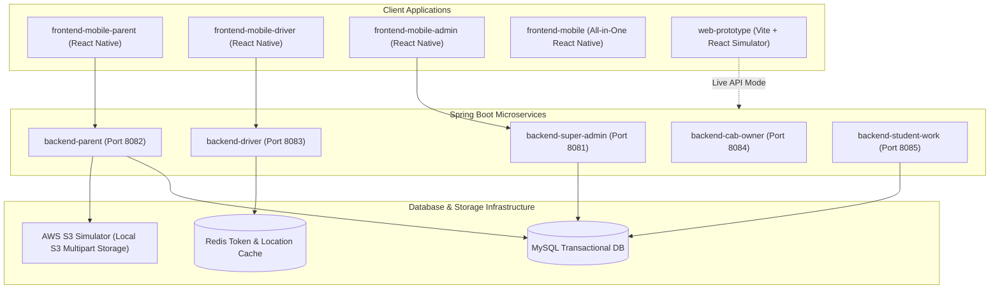

# School & College Cab Management System - Comprehensive Documentation

This document provides complete, detailed documentation of the multi-role cab management and route optimization system (**SafePassage AI**). It includes comprehensive descriptions of every user role, system modules (backends, mobile portals, and simulators), cross-component data flows, security mechanisms, and integration features.

---

## 1. System Overview & Architecture

The SafePassage AI platform is built as a distributed ecosystem targeting school pupils, college commuters, parents, drivers, fleet owners, and platform super administrators. It consists of:
1. **Java Spring Boot Microservices** acting as the backend API layer.
2. **React Native Standalone Mobile Apps** for parents, drivers, and admins.
3. **Vite + React Interactive Web Simulator** for testing all personas and integrations.



---

## 2. User Roles & Features

### 2.1 Parent Portal (Parent Role)
Designed for parents managing their children's daily commutes to schools and colleges.
*   **Explore Cabs & Drivers**: Search for available school/college cabs, view ratings, check seat availability, and explore detailed driver profiles.
*   **Subscription Management**: Subscriptions on weekly, monthly, and quarterly billing cycles. Integration includes Razorpay checkouts with automatic wallet balance deduction fallback.
*   **Live Tracking & Geofencing**: Real-time route progress visualizer, adjustable alert radius slider (0.5 to 2.0 miles) triggering notification alerts, and trip timeline updates.
*   **Child Journey Passport**: Digital profile credentials containing the child's passport photo (stored on local S3 mock), route coordinates, emergency contact numbers, and boarding history.
*   **SOS Panic Button**: Active safety trigger to alert local authorities and the parent console.

### 2.2 Driver & Conductor Portal (Driver Role)
Designed for vehicle conductors and drivers to manage passengers and log active trips.
*   **Conductor Checklist**: Real-time list of assigned students with interactive checklist toggles (`PENDING`, `BOARDED`, `ABSENT`).
*   **Active Trip Controls**: Starts and ends trips, logging check-in times and coordinates directly to the backend database.
*   **Route Map Navigator**: Displays sequence of scheduled stops, optimized directions, and route progress percentages.
*   **Cab Owner Dashboard (Fleet Management)**: Features for fleet owners to manage vehicles, verify driver metrics, check assigned routes, and monitor weekly/monthly earnings.
*   **Emergency Contact Hotline**: Tap-to-call parents directly from the checklist or dial standard SOS dispatchers.

### 2.3 Commuter Hub (Student / Professional Role)
A dedicated interface for independent students and working professionals.
*   **Ride Search Engine**: Matcher system query based on origin, destination, and commute schedules (office/college hours).
*   **Commute Pass Booking**: Direct pass purchasing, ride history schedules, and wallet-linked transactions.

### 2.4 Super Admin Portal (Super Admin Role)
The administrative console for full platform observation and control.
*   **Analytics Dashboard**: High-level KPIs tracking total active drivers, verification pipelines, cumulative revenue, and platform commission.
*   **Fleet Verification**: Document approval pipeline for vehicles (RC, Insurance) and driver KYC checks.
*   **Dispute / Complaint Manager**: Log reports from parents/commuters with options to toggle status to `RESOLVED`.
*   **Offers & Campaigns**: Create and manage active promotions, discounts, and promo code toggles.
*   **AI Demand Recommendations**: Displays simulated corridor demand graphs, suggesting route adjustments based on user heatmaps.

---

## 3. Module Breakdown

### 3.1 Backend Microservices (`backends/`)
Each module runs as an isolated Java application using Spring Boot.

| Module | Default Port | Primary Responsibilities | Core API Endpoints |
| :--- | :--- | :--- | :--- |
| **`backend-super-admin`** | `8081` | JWT Auth, Fleet Verification, Complaints, Promos, Analytics | `/api/auth/login`, `/api/admin/verify`, `/api/admin/complaints` |
| **`backend-parent`** | `8082` | Child Profiles, S3 photo uploads, Wallet billing, Razorpay | `/api/parent/children`, `/api/parent/wallet`, `/api/parent/razorpay` |
| **`backend-driver`** | `8083` | Attendance checklist, start/stop trip, live GPS broadcast | `/api/driver/trip/start`, `/api/driver/checklist`, `/api/driver/gps` |
| **`backend-cab-owner`** | `8084` | Fleet analytics, vehicle listings, driver assignment | `/api/owner/fleet`, `/api/owner/earnings` |
| **`backend-student-work`**| `8085` | Commuter passes, geo-routing matches, scheduling | `/api/commuter/search`, `/api/commuter/passes` |

*   **S3 Multipart Uploads**: Integrated locally in `backend-parent` (ParentController) to simulate writing file payloads directly to disk and serving them back for child passports.
*   **JWT Security Filter**: Implemented across services using custom Spring Security configurations validating tokens in headers (`Authorization: Bearer <JWT>`).

### 3.2 Web Simulator Prototype (`web-prototype/`)
A high-fidelity simulator built with **Vite, React, and TypeScript** located in `web-prototype/`.
*   **Emulator Layout**: Simulates side-by-side execution of mobile devices running Parent, Driver, and Admin screens simultaneously.
*   **Backend Binding Mode**: Features a toggle to switch from "Simulated Data" to "Live API Connected" mode, hitting local Spring Boot servers over localhost ports.

### 3.3 Mobile Applications (`frontend-mobile*`)
Written in **React Native** utilizing **Redux Toolkit** for centralized trip state management.

*   **`frontend-mobile` (All-in-One)**: Integrates Parent, Conductor, and Admin tabs in a single bundle for evaluation.
*   **`frontend-mobile-parent` (Standalone)**: Tailored strictly for parents. Configured with React Navigation nesting stacks.
*   **`frontend-mobile-driver` (Standalone)**: Tailored for conductors and fleet owners. Contains map tracking layers.
*   **`frontend-mobile-admin` (Standalone)**: Tailored for super administrators.

---

## 4. Key Configurations & Integrations

### 4.1 Production Navigation & Deep Linking
To allow navigation between standalone apps or external triggers, deep-linking is configured on `<NavigationContainer>` using React Navigation. 

*   **TypeScript Fix**: The deep-linking configuration is explicitly typed with `LinkingOptions<any>` to resolve nested route definition compatibility errors on typescript containers:
    ```typescript
    import { LinkingOptions } from '@react-navigation/native';

    const linking: LinkingOptions<any> = {
      prefixes: ['safepassage-parent://', 'http://parent.safepassage.com'],
      config: {
        screens: {
          ParentSection: {
            screens: {
              ParentHome: 'home',
              SelectPlan: 'plan/:driverId/:childId',
              LiveTrack: 'track',
              Passport: 'passport',
            }
          }
        }
      }
    };
    ```

### 4.2 Razorpay Payment Fallback Sandbox
When Razorpay sandboxes are not active, the mobile application uses custom checkout routes pointing to the backend's Order Verification controllers. If signature validation fails or gateway responses timeout, the system executes automatic mock success fallback routines so that subscription purchases do not hang in testing loops.

### 4.3 Geolocation coordinate broadcasting
Active trips start background intervals dispatching mock GPS updates to the `LocationController` in the driver microservice, broadcasting coordinate streams across tracking sockets.

---

## 5. Local Setup & Execution

### 5.1 Running the Backend Cluster
You can launch the entire microservice cluster using the provided PowerShell script in the root directory:
```powershell
./run_all.ps1
```
Or start individual microservices manually:
```bash
cd backends/backend-super-admin
./mvnw spring-boot:run
```

### 5.2 Running the Web Simulator
1. Navigate to the web-prototype folder:
   ```bash
   cd web-prototype
   ```
2. Install dependencies and start Vite dev server:
   ```bash
   npm install
   npm run dev
   ```

### 5.3 Running the Mobile Portals
1. Navigate to any mobile folder (e.g. `frontend-mobile-parent`):
   ```bash
   cd frontend-mobile-parent
   ```
2. Install npm modules and start React Native packager:
   ```bash
   npm install
   npm run start
   ```
